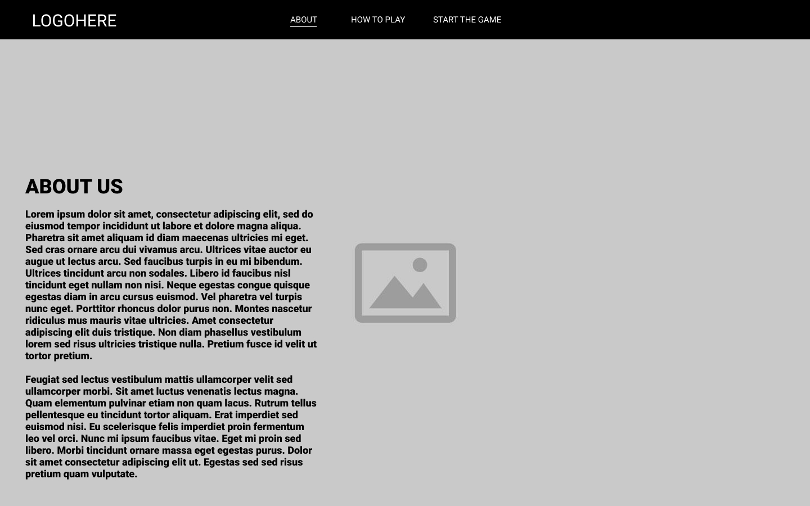
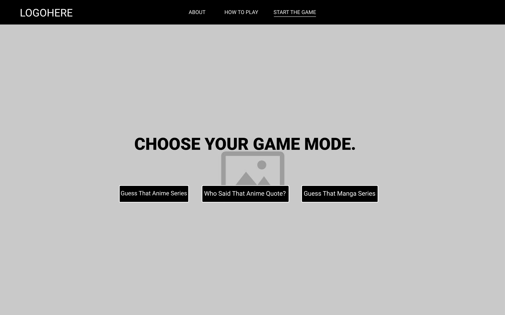
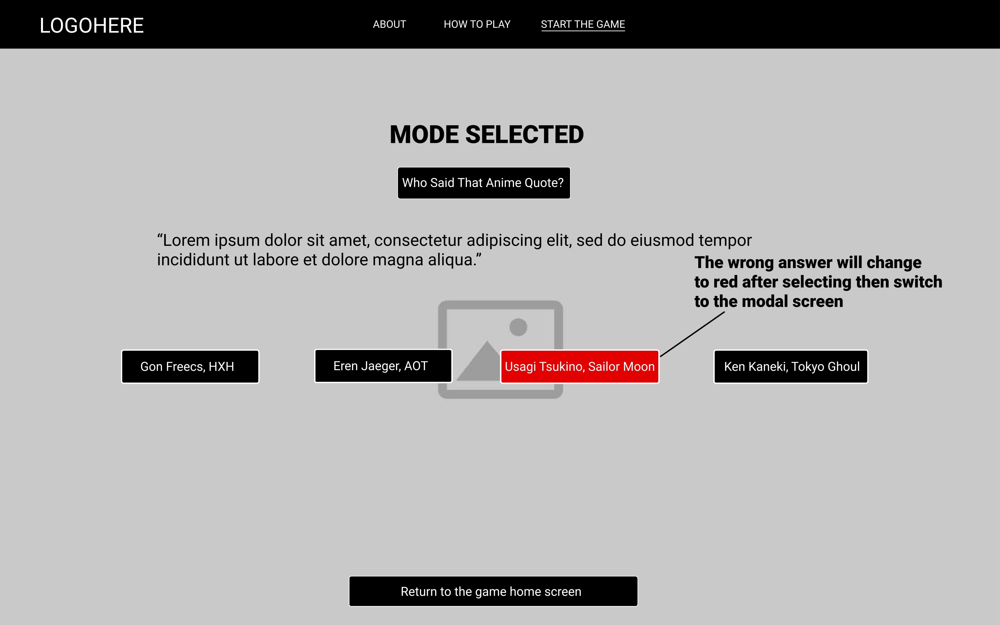
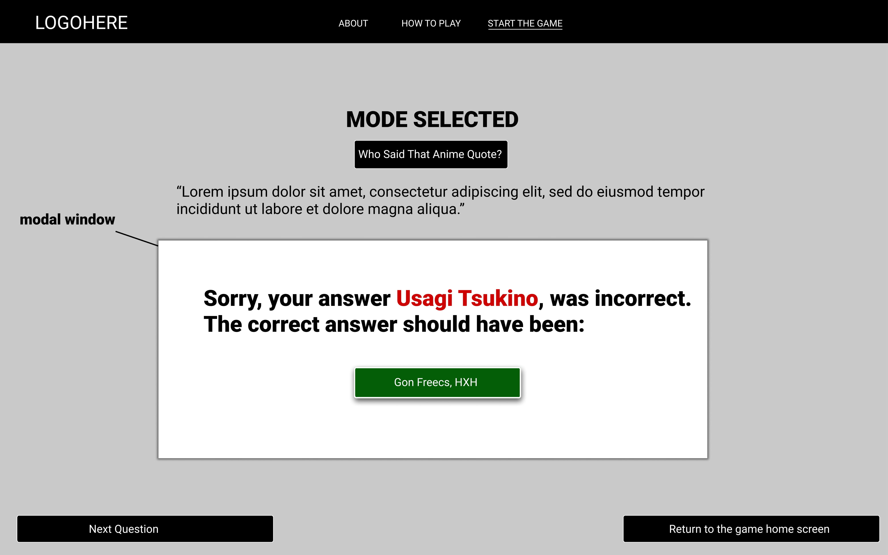
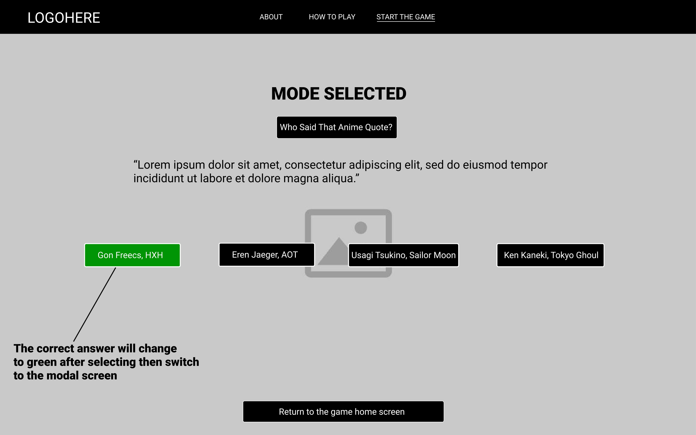
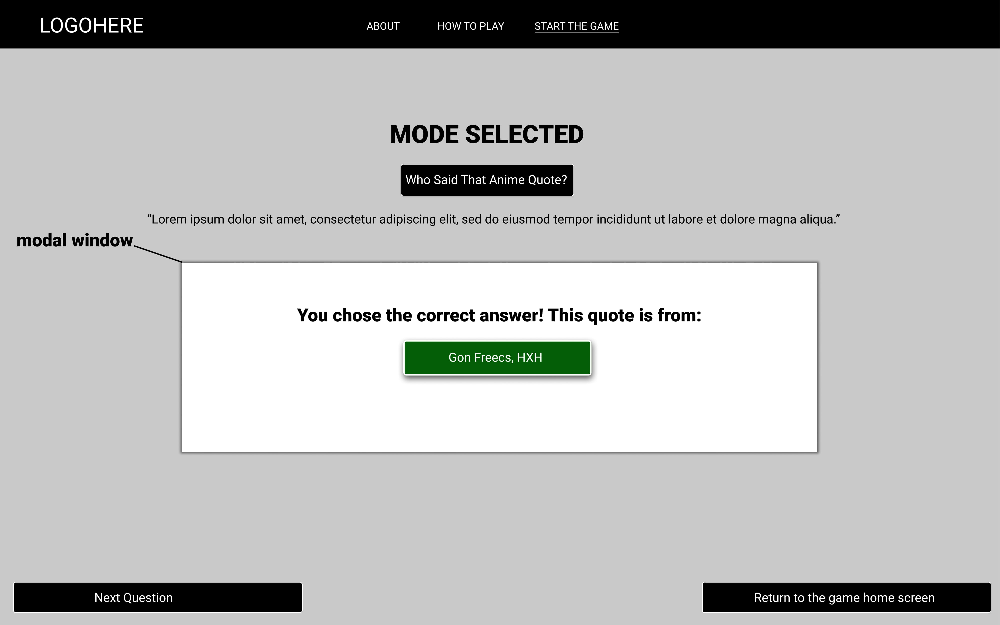

# AniQuiz

## Table of contents 📰
* [Description](#description)
* [Wireframes](#wireframes)
* [API](#api)
* [Dependencies](#dependencies)
* [Additional](#additional)
* [Contributors](#contributors)

## Description📜

### What is AniQuiz?
* **AniQuiz** is meant to be a anime quiz related application. This application is inspired by [RinBot](https://rinbot.moe/).

### Features:
* **About Us Section** (Details who we are as programmers and how we chose this project!)
* **How to Play** (Info on how the game works and how you can play it)
* **Play the Game** (Our main option for accessing the quiz and playing the game) 

### How does AniQuiz Work? 
*  The webpage provides an option between 3 aforementioned game modes: **Guess the anime series, Guess the manga series and Guess that anime quote**.  Once a category is selected, the player will have to select from the multiple choice answers displayed based on the question that was asked. 
*  If the user's chooses the **correct answer**, the button will change to green and a modal will appear congratulating the player on their correct answer. 
*  If the user chooses the **wrong answer**, the button will change to red and a modal will appear revealing the correct answer. 
*  Using the **Jikan API**, we will retrieve an image(s) for the "Guess that manga series" and "Guess that anime series" game modes with four possible choices on what the anime or manga could be. 
*  Using the **AnimeChan API**, we will retrieve popular quotes from an anime series for the player to guess in the "Guess that anime quote" game mode. It will be displayed with four choices on what that anime could be. 

### Goals:

* The purpose/goal of AniQuiz is to test and improve one's knowledge on anime and manga. It's meant to be a fun way to quiz yourself on anime and manga related content. 

## Wireframe on Desktop 🖥️

#### The page will display an anime background and a navigation bar with links to the about us, learning about the game, and starting the game pages. 

#### The start game page will allow the user to choose from 3 possible game modes

#### If you click "Guess that anime quote" for example, It will display a random quote and 4 possible answer choices for selection

#### The wrong answer will change to red after selecting then switch to the modal screen

#### The correct answer will change to green after selecting then switch to the modal screen

## Wireframes:🖊️
#### If the wireframe file image is too big to read, right click on the image to open image in a new tab*
- [Desktop Wireframe](https://github.com/hydeiablakey/Final_Project_1/blob/main/wireframes/desktop/Wireframe_Project_Desktop-1.png)
- [Mobile Wireframe](wireframes\mobile\Wireframe_Project_Mobile-1.png)
- [Figma Wireframe File](https://www.figma.com/file/2NqUqIVdoXK33r0yTomNqV/Wireframe_Project_1?node-id=11%3A17)

## API: 📝
- [Jikan Api](https://jikan.moe/)
- [AnimeChan Api](https://animechan.vercel.app/) 

## Dependencies 
- [Axios](https://github.com/axios/axios)
- [Parcel](https://parceljs.org/)

## Additional: 💭
### Future functionality that we would like to have: 
- Points System (Whenever the user gets an answer right, they get one point) 
- Display Points System (There would be a scoreboard detailing how many points in total they received)

## Contributors:💻

Connect with us! 

 

