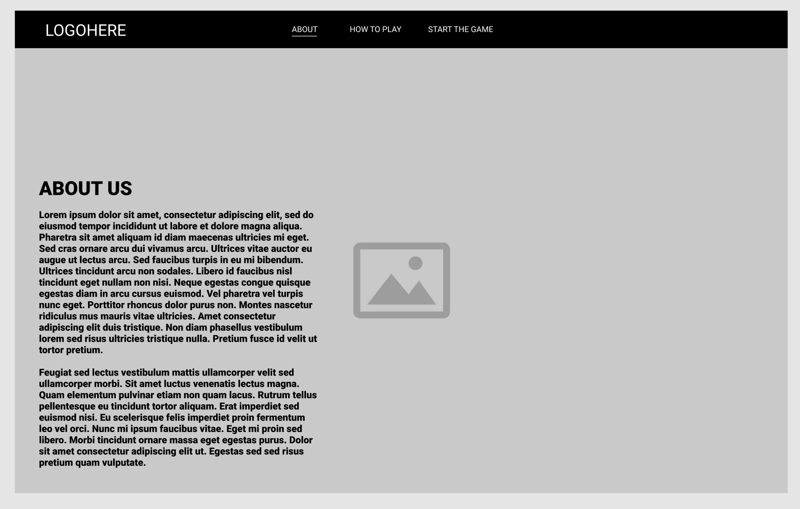
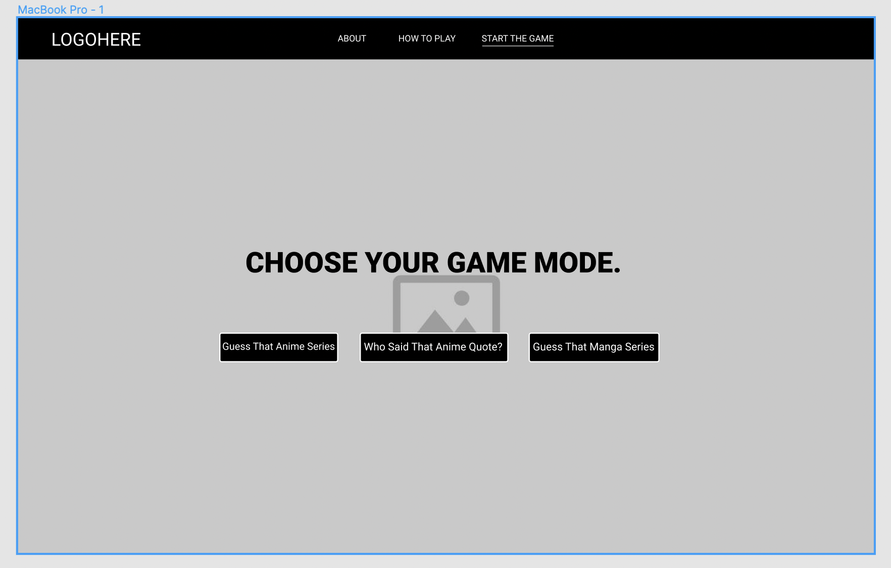

# App Title: AniQuiz

## Table of contents
* [Description](#description)
* [Wireframes](#wireframes)
* [API](#api)
* [Requirements](#requirements)
* [Additional](#additional)
* [Contributors](#contributors)
 

## Description
The purpose for AniQuiz is to test and improve one's knowledge on anime, manga, and anime quotes. The webpage provides an option between the 3 aforementioned categories. Once a category is selected, the player will have to select from the multiple choice answers displayed. Depending on the users answer a model will appear either congratulating the player or revealing the correct answer. Using the Jikan API, we retrieve an image for the question and four possible choices for both the anime and manga categories. We apply the second API (AnimeChan) to retrieve data for the questions of the anime quotes category and its four possible answer choices.

### Landing Page

#### The page will display an anime background and 3 buttons for an about us, learning about the game, and starting the game.

#### The start game will display an image or quote and four multiple answers

#### The wrong answer will change to red after selecting then switch to the modal screen

#### The correct answer will change to green after selecting then switch to the modal screen

## Wireframes:
- [Desktop Wireframe](https://www.figma.com/file/2NqUqIVdoXK33r0yTomNqV/Wireframe_Project_1?node-id=11%3A17)
- [Mobile Wireframe](https://www.figma.com/file/2NqUqIVdoXK33r0yTomNqV/Wireframe_Project_1?node-id=17%3A2)

## API: [Jikan Api](https://jikan.moe/), [AnimeChan Api](https://animechan.vercel.app/) 

## Requirements: 

## Additional:

## Contributors:

